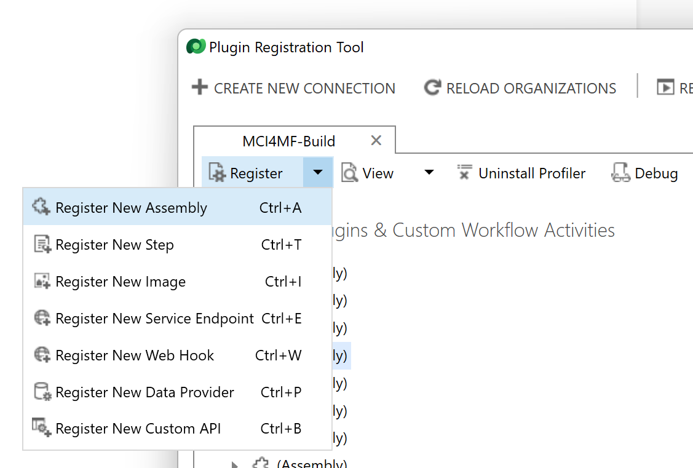

# Azure Data Lake to Dataverse

This sample demonstrates how an Azure Data Lake file can be synced to a Dataverse table. The main use case for this scenario is bringing aggregated data created by a big data platform (e.g. Azure Synapse) and stored in a storage account or data lake back to the user application landscape (e.g. Power Apps) by leveraging virtual tables. This is particularely useful when no dedicated SQL database can or should be used.


## Prerequisites

The following requirements must be met in order to follow the steps below

- Access to an Azure subscription
- Azure CLI installed
- Visual Studio IDE
- .NET Framework 4.7.1 must be installed
- Access to Power Platform (and sufficient permissions to create solutions and tables)
- Python 3 installed (for helper scripts)

## Creating a synced virtual table

### 1. Service Principal creation

The service principal created in this step will be used by the Dynamics custom virtual table provider to access the data lake as well as the helper scripts to create a virtual table in Power Platform.

Open a command prompt an log into Azure

```
az login
```

Then create a new app registration

```
az ad app create --display-name <app name>
```

The response will contain the app id. Use it in the next step to create an associated service principal

```
az ad sp create --id <app id>
```

And an app secret:

```
az ad app credential reset --id <app id> --display-name Default --append
```

Write down the password (client secret) you get back.
NOTE: If you get an error message here, make sure to upgrade to the latest CLI version.

Finally give the app the permission to access Dynamics:

```
az ad app permission add --id <app id> --api 00000007-0000-0000-c000-000000000000 --api-permissions 78ce3f0f-a1ce-49c2-8cde-64b5c0896db4=Scope
```

`78ce3f0f-a1ce-49c2-8cde-64b5c0896db4` is the ID of the user_impersonation permission of the Dynamics CRM API.

### 2. Azure Data Lake & sample data

If you already have a data lake in place you can skip section a) and continue with b).

a. Open a command prompt and type the following:

```
az storage account create --name <data lake name> --resource-group <resource group name> --enable-hierarchical-namespace true
```

This will create an Azure Data Lake Storage Gen2 account. Afterwards create a file system with

```
az storage fs create -n <container name> --account-name <data lake name>
```

b. We now add a "Storage Blob Data Contributor" role assignment for the service principal we created in step 1 to access the data lake. We need the full resource ID of the data lake, afterwards type

```
az role assignment create --assignee <app id> --role "Storage Blob Data Contributor" --scope "/subscriptions/<subscription name>/resourceGroups/<resourcegroup name>/providers/Microsoft.Storage/storageAccounts/<datalake name>"
```

c. Next we create sample data in the storage account by using the helper script. NOTE: Don't use the Azure Portal to add sample data, otherwise the plugin tool will fail to write or update this file later on. Open a shell/bash, change directory to `scripts/` and log into Azure using the service principal credentials:

```
read -sp "Client secret: " AZ_PASS && echo && az login --service-principal -u <AAD app registration client ID> -p $AZ_PASS --tenant <AAD tenant id>
```

When asked, enter the client secret. Then execute the following command after replacing the dummy values:

NOTE: You must have the Azure Identity package installed: `pip install azure-identity`.

```
python helper.py datalake sampledata --datalake_name <name of your datalake> --datalake_container_name <name of data lake container>
```

This will create a file metrics.csv in the root folder of your container with the following content.

```
MetricId,Name,Value
"bbb9792d-9fbf-45d5-88e5-dce2acd4924c","AverageTripDuration",26.1
"1cb4e68d-6ee3-4b1b-b90b-a1e49daeef03","LongestTrip",180.5
"262bd819-8eaa-44c8-96f8-eced6874cba1","WeekendWeekdayRatio",0.45
```

If the script raises an exception, check if the values are correct and if your service principal has "Storage Blob Data Contributor" permissions on the data lake.


### 3. Adopting the virtual table provider code

a. Log into your Power Platform environment and click on "Solutions" > "New solution". Select a name and a publisher and click on "Create". In your solution, click on "New" > "More" > "Environment Variable". We will add the following environment variables:

| Name                          | Data Type       | Value |
| ----------------------------- | --------------- | ----- |
| \<publisher\>_AADTenant       | Text            | The AAD tenant ID |
| \<publisher\>_AADClientId     | Text            | The app registration client Id
| \<publisher\>_AADClientSecret | Text            | The app registration client secret
| \<publisher\>_AADTokenScope   | Text            | https://\<datalakename\>.dfs.core.windows.net/.default
| \<publisher\>_DataPath        | Text            | https://\<datalakename\>.dfs.core.windows.net/\<containername\>/metrics.csv

NOTE: If you have an Azure Key Vault available, a good practice is to store the client secret there and use the Data Type "Secret" instead of plain text. In code the secret can then be retrieved by placing a `new OrganizationRequest("RetrieveEnvironmentVariableSecretValue");`

b. Open the `MetricProvider.sln` file under `src/` and switch to `Connection.cs`. Find the line `public static string PublisherName = "<REPLACE WITH YOUR PUBLISHER NAME>";` and replace the value with your publisher name.

c. In the Visual Studio Solution Explorer right click on "MetricProvider" > "Properties" > "Signing" and click on "Sign the assembly". Select an existing key or create a new one. Note, that the assembly must be signed, otherwise the subsequent steps will fail.


d. Right click on "Metric Provider" > "Build". This will create a .dll file in the `bin/` folder.

### 4. Registering the assembly & data providers

a. We use the Plugin Registration tool to upload the .dll we created in the previous step to Power Platform. Therefore, [download the tool](https://www.nuget.org/packages/Microsoft.CrmSdk.XrmTooling.PluginRegistrationTool) switch to the package download location and open `PluginRegistration.exe`.

b. Click on "Create new connection" and enter your Power Platform login credentials. Then click on "Register" > "Register new assembly"



Select your MetricProvider.dll binary and click on "Register Selected Plugin".

c. Click on "Register" > "Register New Data Provider". Choose the name "MetricDP" and select the Power Platform solution you created earlier. Under "Data Source Entity" select "Create New Data Source"


Enter "MetricDS" as the display name, add your solution and click "Create" - this will create a virtual table entity in your Dataverse.

d. Go back to Power Platform and click on "Settings" > "Advanced settings" > "Administration" > "Virtual Entity Data Sources" > "New". Select the data provider "MetricDP" you created earlier and enter the new name "MetricDatasource" for the virtual entity data source.


### Virtual table creation & testing

a. We have to add the service principal we created in the first step to the Power Platform environment. Go to the Power Platform Admin center > "Environments" > Select your environment > "Settings" > "Users + permissions" > "Application users". Click on "New app user" and select the app registration you created earlier. 

b. Select the newly created user and click "Edit security roles", enable the "Dataverse Search Role" and "System Administrator" (after creation of the virtual table you can remove these permissions again).

c. The final step is creating the actual virtual table. For doing so we make use of the helper script again. Switch to the scripts/ folder and run the following command:

```
python helper.py dataverse virtualtable --power_apps_org <Power Platform environment name> --publisher <Power Platform publisher name> --provider_name MetricDP --datasource_name MetricDatasource
```

This should create a new table "Metric" in Dataverse. We should now be able to see the content of the metric.csv file from Azure Data Lake in dataverse.


NOTE: The plugin presented in this repository is reading and parsing a CSV file from Data Lake using the REST API. This has certain performance limitations and is therefore only recommended for small datasets.

## Troubleshooting

If you encounter issues while adopting and developing the custom virtual table provider, you might use the Power Platform trace log by clicking on settings > "Advanced settings" > "Plug-In Trace Log". Whenever a `InvalidPluginExecutionException` exception is thrown, this will be visible here.


## Resources

- Using custom virtual table providers with a SQL database backend instead of a data lake file: https://docs.microsoft.com/en-us/power-apps/developer/data-platform/virtual-entities/sample-ve-provider-crud-operations
- Dataverse REST API: https://docs.microsoft.com/en-us/power-apps/developer/data-platform/webapi/associate-disassociate-entities-using-web-api